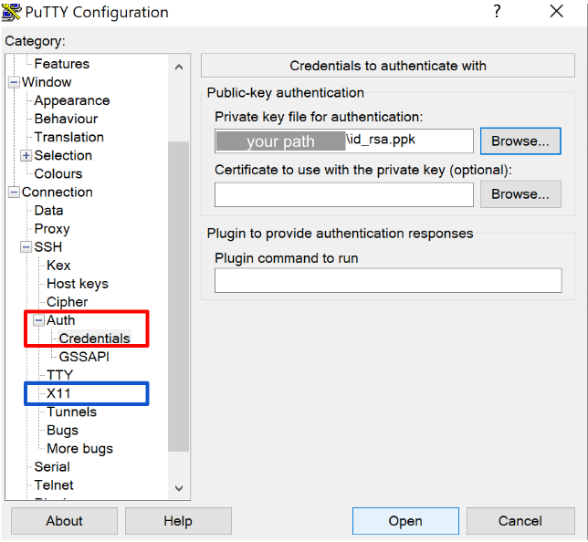

# Sorting on Rhino

In this guide, we outline information needed to run automatic sorting and manual selection 
of [Combinato](https://github.com/jniediek/combinato/) on Rhino.

## Overview

Raw neural data is typically very large. 
Spike sorting can be a computationally expensive process as well.

Maintaining an organized server with the data as well as computation resources is crucial.

As of 2025, the Jacobs lab uses UPenn's Rhino to organize its data, run preprocessing and
analyses. Using Rhino to sort data is _not_ straightforward, but the access to the resources
pays off - so bare with us!

While the current guide is specific to Rhino, it may be useful to those with other SLURM 
servers.

## Resources

This template assumes you have access to a Windows or Macbook. Their operating systems interact
differently with Rhino. This is especially important for the manual selection step.

### Installing Combinato

For tutorials and documentation, see the
[Wiki](https://github.com/jniediek/combinato/wiki/)

#### Clone the repository
We **strongly** suggest that cloning the HSUPipeline combinato 
[fork](https://github.com/HSUPipeline/combinato) instead of the original repo:
`git clone https://github.com/HSUPipeline/combinato.git`

#### Set up your environment
Option 1 (recommended)
```
conda create -n combinato python=3.7.4
conda activate combinatconda install scipy==1.3.1 matplotlib==3.1.1
```

Option 2 
```
conda env create -f combinato_environment.yml
```

#### Install
First navigate to where you git cloned your repo to, then:
```
python3 setup_options.py
```


## GUI Set Up

To manually curate the automatically sorted neural data, you need to let Rhino
access your display resources, which can then be used by the combinato GUI.

As mentioned, to set this access, Windows and Os systems work differently.

### Windows

Instructions adapted from [here](https://docs.cse.lehigh.edu/xforwarding/xforwarding-win/):
1. Install [xming](https://sourceforge.net/projects/xming/) and set it up
2. Install putty (recommended: follow the instructions [here](https://laptops.eng.uci.edu/engineering-software/using-linux/how-to-configure-putty-xming-on-your-laptop))
3. Open putty
4. Write `rhino2.psych.upenn.edu` as the host
5. Go to SSH/X11 (in blue) and set X11 forwarding 
6. Go to (in red) "Authentication parameters">"Browse..." >"Private key file for authentication"
7. Locate your "id_rsa.ppk" private key and click "Open"
8. Set `DISPLAY 127.0.0.1:0.0`




We recommend saving those session settings to putty so that you don't have to input them 
everytime you want to use the combinato GUI.

Putty then will prompt you to input your Rhino username, password, then duo code
(just as a terminal ssh would).

### Macbook
1. Install XQuartz 2.8.0 / 2.8.1 on your macbook
2. Run on macbook terminal
   `write org.xquartz.X11 enable_iglx -bool YES`
3. Run on rhino
   `export LIBGL_ALWAYS_INDIRECT=1`

## GUI Usage
Once your files are split, and you ran the automatic sorting, you need to
manually sort. To do so, you need to open the combinato GUI.
Once more, a Windows and a Macbook will need different strategies.

### Windows
1. Open Xming (nothing should happen, just the xming icon should appear at the bottom right of your screen)
2. Open putty
3. Load your saved Rhino settings (or go back to GUI Set Up and follow the steps)
4. Login
5. Navigate to the parent folder where your channel folders with the automatically sorted data is.
6. `css-gui`

### Macbook
1. Ssh into rhino with the `-X` tag.
   `ssh -X $USER@rhino2.psych.upenn.edu`
2. Login
3. Navigate to the parent folder where your channel folders with the automatically sorted data is.
4. `css-gui`
